# Portable EV Charging System

## Abstract
Imagine owning an electric vehicle (EV) that runs out of charge just before reaching your destination. In this situation, you may need to tow the vehicle to the nearest charging station or pay for a mobile EV charging service, both of which can be expensive and time-consuming. An emergency portable charging station stored inside the vehicle could provide enough temporary charge to safely reach the nearest charging station.

The system consists of an external battery to represent a portable emergency charging station, an EV battery model (plant), a DC-DC buck converter (actuator), a closed-loop CC-CV charging controller, thermal models for the EV battery and buck converter, SOC and CC-CV logic using Stateflow, and a feedback system to continuously monitor and regulate the charging process.

## Project Objectives
* Demonstrate the operation of a portable EV charging system.
* Verify that the EV battery charges successfully and the State of Charge (SOC) increases.
* Validate the closed-loop CC-CV charging strategy
* Test the charging system using a larger EV battery based on the 2024 Cadillac Lyriq battery specifications.
* Monitor the thermal behavior of the IGBT and EV battery during the charging process.

## Repository Structure
| Folder/File | Description |
|-------------|-------------|
| `images/` | System diagrams, subsystem figures, and simulation screenshots. |
| `tests/` | Simulation test cases and validation results. |
| `data/` | Battery parameter spreadsheets and supporting datasets. |
| `docs/` | Project presentation and additional documentation. |
| `main.m` | Main MATLAB script used to run the project. |
| `Portable_Charging_System.slx` | Main Simulink model of the portable EV charging system. |

## Required Software and Toolboxes
| Software / Toolbox |
|--------------------|
| MATLAB |
| Simulink |
| Simscape Electrical |
| Stateflow |

## System-Level Architecture (Block Level)
The figure below illustrates the closed-loop control system architecture of the portable EV charging system.

## Flowchart Architecture

## Subsystem Descriptions
### CC-CV Logic 
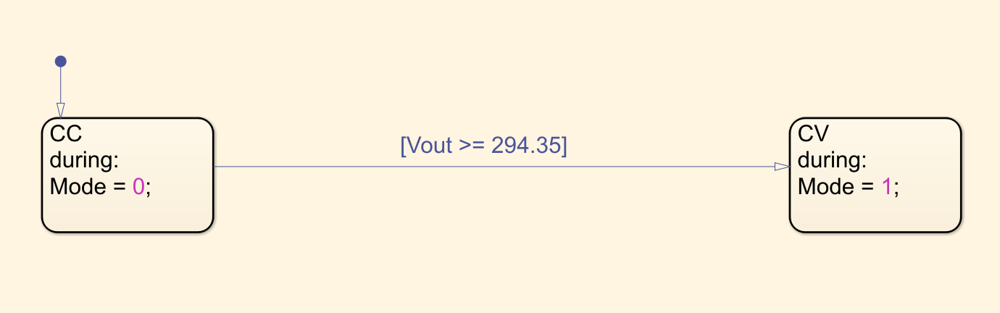

Let's first talk about the CC-CV Logic subsystem and its purpose in this system-level design. Simply put, the subsystem first has to analyze the feedback loop of the output voltage of the EV system and decide between two modes: Mode 0 being CC mode and Mode 1 being CV mode. In this case, the output voltage must satisfy the condition of Vout ≥ 294.35V before transitioning to CV mode. In pseudocode, we can say if Vout < 294.35, then conduct using Mode 0 or CC mode; else, if Vout >= 294.35, transition the state from CC to CV mode or Mode 1. In the process, it has to continuously provide an output mode to the CC-CV Controller subsystem and decide, based on another threshold (we'll get to this), if it should switch between the controllers.

### Charge Termination Current Logic
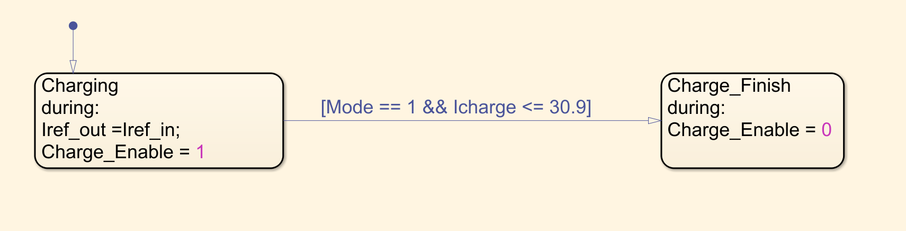

Charge termination current logic is also another part of the CC-CV system and its characteristics. The purpose of this logic is to initiate a current cutoff once the battery is fully charged. In this experiment's case, I have modeled the termination current as C/10. C in this model represents the total capacity of the EV battery (309 Ah). C/10 outputs exactly 30.9 A. The condition of this Stateflow logic continues to operate in charging mode as long as the Iref output (CC-CV Controller current reference) is the same as the input reference, 35 A, representing the charging current. Once the system detects both Mode 1 (CV Mode) and Icharge ≤ 30.9 A, it transitions from Charging to Charging Finished, switching the current automatically to 0 A. This subsystem is particularly useful for handling battery overcharging in a CC-CV charging system.

### CC-CV Controller
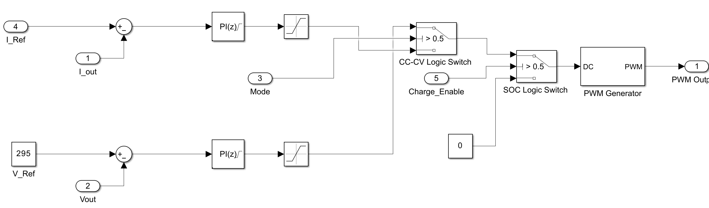

The controller of any system is a very important piece of any control system design, as it allows the regulation of the system. In this case, I have designed a simple CC-CV Controller which uses switch logic to switch between Mode 0 (CC) and Mode 1 (CV). In the beginning of the experiment, the current error is given by $e_I = I_{ref} - I_{out}$, where $I_{ref}$ represents the charging current of 35 A and $I_{out}$ represents the EV battery charging output. The PI controller slowly drives this error to zero, allowing the system to regulate the current at 35 A.

Once the experiment transitions (this happens due to the CC-CV Logic implementation) to Mode 1 (CV Mode), the current controller is no longer active, and the voltage controller now regulates the output voltage. The same idea as before, the voltage error is given by $e_V = V_{ref} - V_{out}$, where $V_{ref}$ represents the reference voltage of 295 V, and $V_{out}$ represents the EV battery output voltage.

For the best explanation, let's think about an example to see how this controller might work. For instance, if the EV battery outputs 33.4 A (this could be due to oscillating factors or because it hasn't reached steady state), and we know the current reference is 35 A, it would produce a 1.6 A error in the system. The controller then increases the PWM duty cycle, allowing the buck converter to transfer more current to the system.

### External Portable Charger 
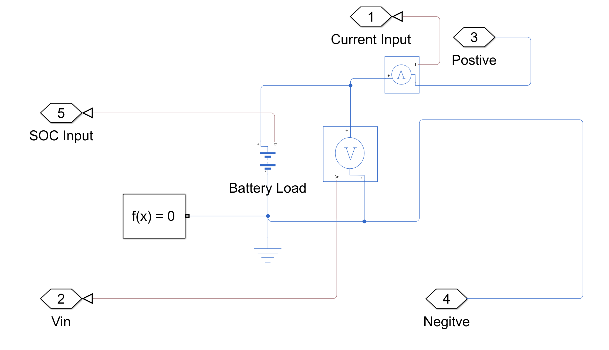

The External Portable Battery Charger provides a parameterized value of a 430 V DC source. To allow the charging process to work, this value must always be greater than the EV battery's initial terminal voltage (approximately 294.8 V at 5% SOC before charging begins). Additionally, its battery capacity is modeled at 6.8 Ah, allowing it to store approximately 2.924 kWh of energy. This is an important parameter to know, especially in the design of more highly complex charging systems. We will get to a more detailed analysis in the EV Battery subsystem.

### EV Battery/Plant
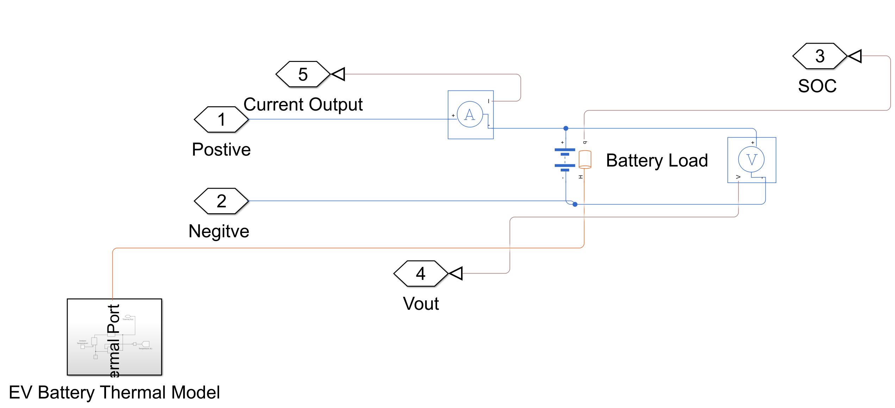

Now that we know a little about what the External Portable Charger does, let's analyze the Plant of this control system design. The EV battery we have parameterized is an approximated model of the Cadillac Lyriq 2024 (all of the data information can be found in the data/ portion of this project). Since we couldn't model a much more detailed battery pack, which is usually done using cells in series and parallel with specific dimensions, we have constructed a much simpler Simscape model for the purpose of simulation time and simplicity. The EV battery nominal voltage is 350 V without any initial conditions. With the initial condition applied at 5% SOC, the voltage has decreased to approximately 294.8 V. The battery capacity is modeled as 309 Ah, providing approximately 108.15 kWh (when fully charged). Since we have modeled this experiment at 5% SOC, the EV battery stores approximately 5.41 kWh of energy and therefore needs approximately 102.74 kWh of additional energy to reach 100% SOC (fully charged). 

Now here is the interesting part of this EV vehicle. Since we know the portable charger stores around 2.924 kWh of energy, if we start our system with 5% SOC, it would take approximately 17 minutes for the portable charger capacity to become empty. This is constructed from the maximum charging power, 294.8 V × 35 A = 10.3 kW. Taking this value, 2.924 kWh / 10.3 kW = 0.284 hours ≈ 17 minutes (this is assuming ideal efficiency of the system). Thus, the system would go from 5% SOC to around 7.7% SOC, knowing that 2.924 kWh / 108.15 kWh × 100 ≈ 2.7%. This is all very important, as it allows us to compute how much mileage the external charger can provide to the EV battery until the capacity of the portable charger is empty. In this case, since the Cadillac Lyriq estimated energy consumption is around 314 Wh/mile, we can calculate 2924 Wh / 300 Wh/mile ≈ 9.31 miles of additional driving range.

### DC-DC Buck Converter/Actuator
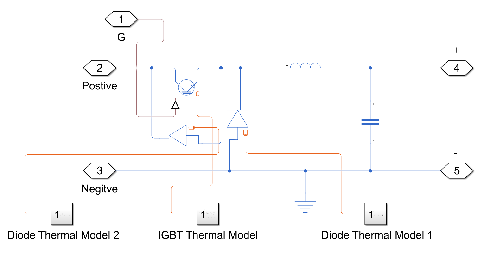

The general purpose of a buck converter is to step down the input voltage. Why do we need to step down the voltage? The main reason is to protect the load being powered. Let's look at it this way. If we removed the buck converter from our system and directly supplied the 430 V output of the portable charger to the EV battery, the battery would no longer receive a controlled charging voltage or current. This could place excessive electrical stress on the system and damage the battery. Components such as resistors, capacitors, inductors, and semiconductor devices could overheat or fail. In the worst-case scenario, the uncontrolled charging process could cause catastrophic damage to both the charging system and the EV battery.

### SOC Estimation by Coulomb Counting
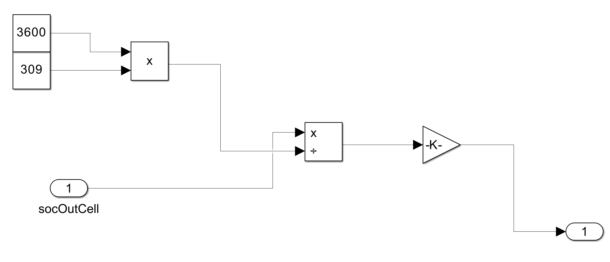

In this system, for us to be able to verify if the charging process is working, we have to consider a fairly simple mathematical model called State of Charge (SOC) using the method of Coulomb Counting. SOC, in general, represents the amount of charge in a battery relative to its starting capacity. For instance, in our model specifically, 309 Ah represents the full capacity of the battery; however, since we want to simulate this with a 5% SOC starting point, we take 0.05 × 309 = 15.45 Ah. 15.45 Ah here would represent the initial charge of our EV battery to represent 5% SOC. To represent this subsystem in a more mathematical way, we can consider the equation obtained from the MathWorks documentation: $$\mathrm{SOC}(t)=\mathrm{SOC}(t_0)+\frac{1}{C_{\mathrm{rated}}}\int_{t_0}^{t} I_{\mathrm{batt}}\,dt$$. There are three important things we have to carefully analyze in this equation: the numerator, which represents the change in the battery charge over time, $$\int_{t_0}^{t} I_{\mathrm{batt}}\,dt$$ the denominator, which represents the rated battery capacity, $$C_{\mathrm{rated}}$$ and SOC(t0), which is the initial state of charge at the initial time t0.

Although this equation describes the general formulation of the Coulomb Counting method, our implementation is simplified by utilizing the remaining charge output provided by the Simscape Battery model instead of explicitly integrating the battery current. This is done by considering the following formula: $$\mathrm{SOC}=\frac{Q_{\mathrm{remaining}}}{3600\,C_{\mathrm{rated}}}$$

### Charging Efficiency
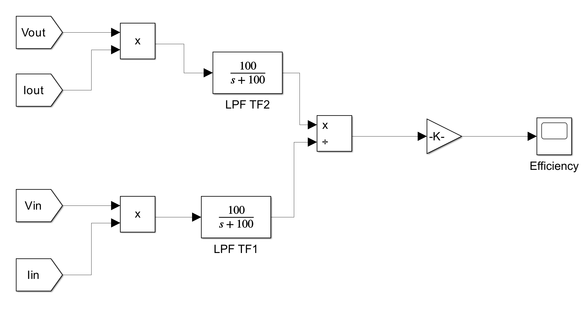

In any system, we always want to know the efficiency, as it allows us to measure how ideal or non-ideal a system really is. We modeled this using the well-known equation $$\eta_{\mathrm{charging}}=\frac{P_{\mathrm{EV\ battery,\ output}}}{P_{\mathrm{Portable\ Charger,\ input}}}\times100\%$$ Additionally, we used a Low Pass Filter (LPF) to allow the efficiency output to use average values rather than oscillating PWM values.

### EV Thermal Model
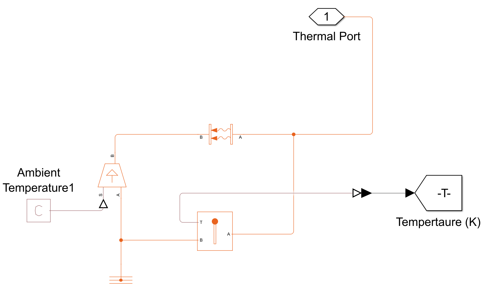

This subsystem analyzes the thermal characteristics of the EV battery, parameterized with an ambient temperature of 298.15 K (25°C), representing standard room temperature. It allows heat to flow between the battery and the surrounding environment. Heat is primarily generated due to electrical losses during the charging process.

### IGBT Thermal Model
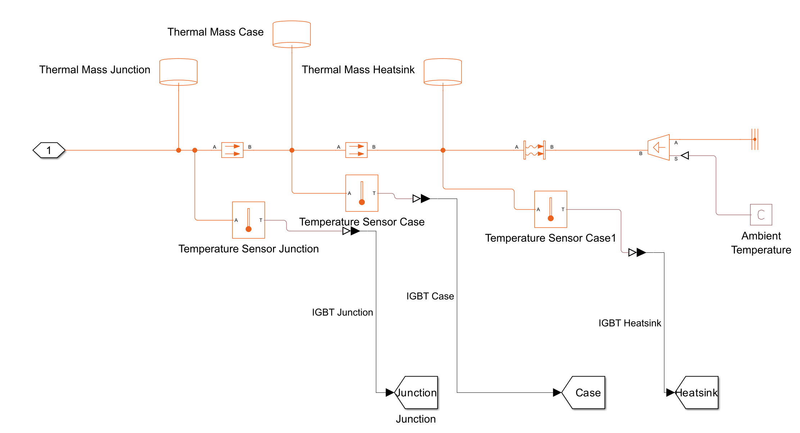

In a much more complex system, semiconductors need to be cooled so that the system operates under normal conditions. For instance, let's analyze this IGBT thermal model, which demonstrates the process of dissipating heat. The model starts by taking the electrical losses (heat) generated by the IGBT and introducing them into the thermal model through a Heat Flow block. Once the heat is transferred into the model, the dissipation process begins. The heat then flows through a series of thermal masses, which act as reservoirs that temporarily store heat since heat takes time to travel through materials. The junction represents the semiconductor inside the IGBT where the heat is first generated. The heat is then transferred by conduction to the case, which represents the IGBT package. Finally, the heat is transferred by conduction to the heat sink, where it is dissipated into the surrounding air through convection to the ambient temperature, which was modeled as 298.15 K.

## Testing and Verification
### Test 1: EV Battery Validation

#### CC-CV Charging Voltage Response
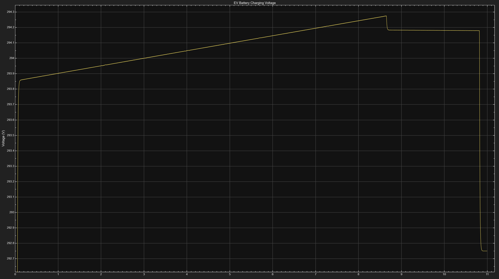

To understand how the CC-CV charging process works, analyzing the voltage response plot is necessary. Ideally, voltage increases during CC mode and remains constant during CV mode. At the start of the charging process, the voltage shows a smooth transient response with no startup oscillation. The voltage rises toward the 295V reference. From 0 to approximately 8.6541 seconds, the voltage increases by 0.4211V, from 293.8534V to 294.2745V, during the constant current region.

From 8.6541 seconds to 8.7180 seconds, the CC to CV transition occurs. During this transition, the voltage dips from 294.2745V to 294.1825V. In our case, this voltage dip occurs because the charging current changes as the voltage controller takes over.

This leads into CV mode, where the voltage remains nearly constant. From 8.7180 s to 10.8210 s, the voltage decreases by only 0.0066V, from 294.1829V to 294.1763V. A 6.6mV change is extremely small, showing that constant voltage is effective at regulation during the charging phase. Another detail that should stand out is the sudden voltage dip at exactly 10.8210 seconds/

#### CC-CV Charging Current Response
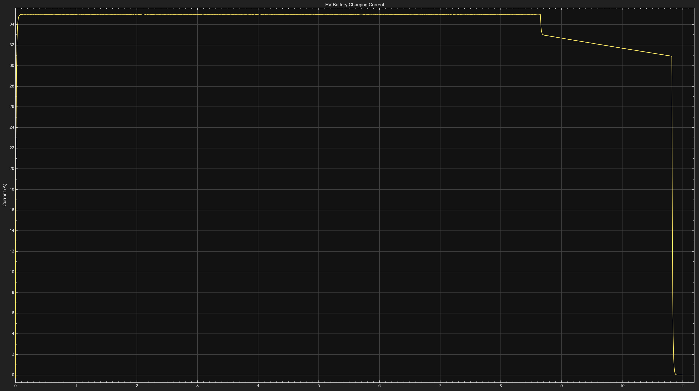

#### State of Charge (SOC)
!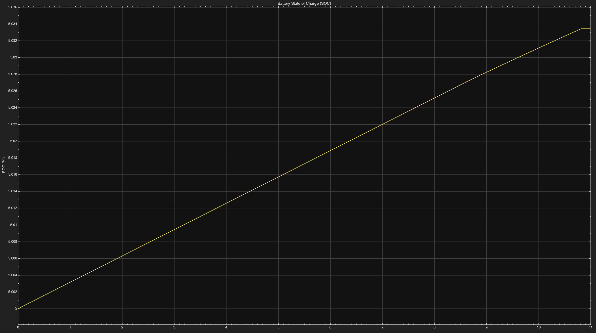

#### Thermal Response

## Future Work

## Acknowledgment

## References
MathWorks Documentation – Buck Converter Block
https://www.mathworks.com/help/sps/ref/buckconverter.html

EV Database – 2024 Cadillac Lyriq 600 E4 Specifications
https://ev-database.org/car/2243/Cadillac-Lyriq-600-E4

Panasonic Battery Group – NCR18500 Lithium-Ion Battery Datasheet
https://www.alldatasheet.com/datasheet-pdf/pdf/597037/PANASONICBATTERY/NCR18500.html

MathWorks Documentation – Buck Converter Thermal Model
https://www.mathworks.com/help/sps/ug/buck-converter-thermal-model.html

MathWorks Documentation – Battery State of Health Estimation
https://www.mathworks.com/help/simscape-battery/ug/battery-state-of-health-estimation.html

