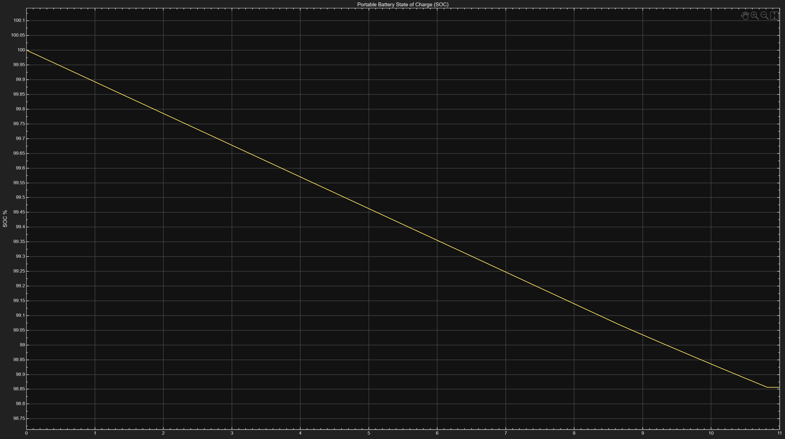
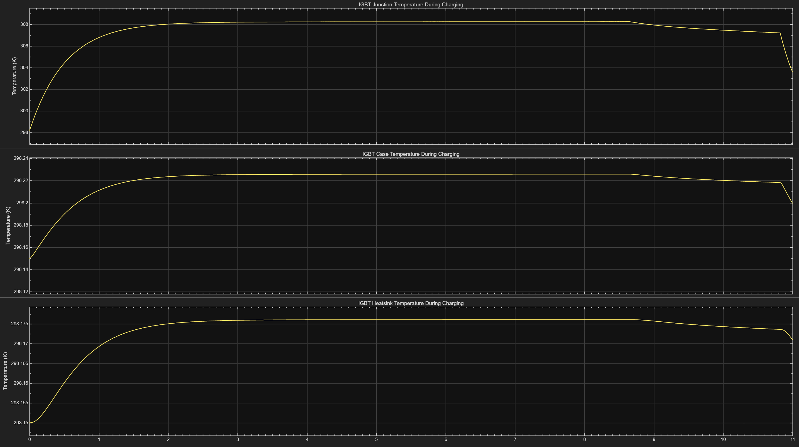
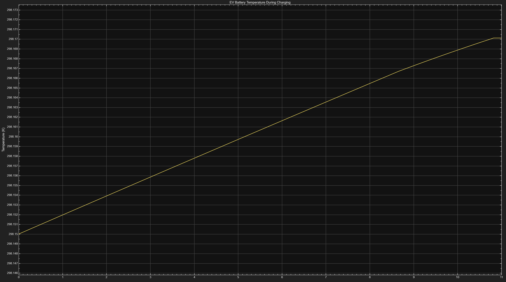
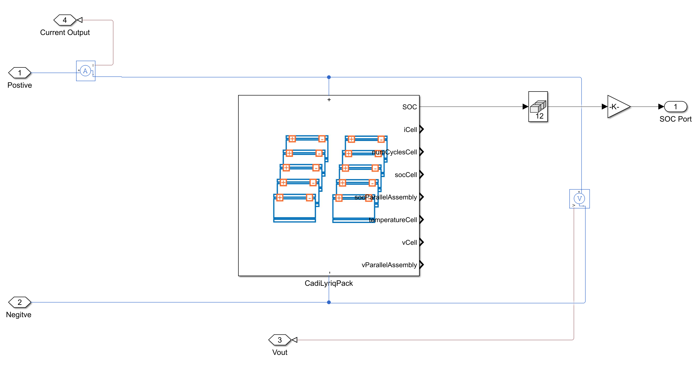

# CC-CV Portable EV Charging System

## Abstract
Imagine owning an electric vehicle (EV) that runs out of charge just before reaching your destination. In this situation, you may need to tow the vehicle to the nearest charging station or pay for a mobile EV charging service, both of which can be expensive and time-consuming. An emergency portable charging station stored inside the vehicle could provide enough temporary charge to safely reach the nearest charging station.

The system consists of an external battery to represent a portable emergency charging station, an EV battery model (plant), a DC-DC buck converter (actuator), a closed-loop CC-CV charging controller, thermal models for the EV battery and buck converter, SOC and CC-CV logic using Stateflow, and a feedback system to continuously monitor and regulate the charging process.

## Project Objectives
* Demonstrate the operation of a portable EV charging system.
* Verify that the EV battery charges successfully and the State of Charge (SOC) increases.
* Validate the closed-loop CC-CV charging strategy
* Test the charging system using a larger EV battery based on the 2024 Cadillac Lyriq battery specifications.
* Monitor the thermal behavior of the IGBT and EV battery during the charging process.

## Repository Structure
| Folder/File | Description |
|-------------|-------------|
| `images/` | System diagrams, subsystem figures, and simulation screenshots. |
| `tests/` | Simulation test cases and validation results. |
| `data/` | Battery parameter spreadsheets and supporting datasets. |
| `docs/` | Project presentation and additional documentation. |
| `main.m` | Main MATLAB script used to run the project. |
| `Portable_Charging_System.slx` | Main Simulink model of the portable EV charging system. |

## Required Software and Toolboxes
| Software / Toolbox |
|--------------------|
| MATLAB |
| Simulink |
| Simscape Electrical |
| Stateflow |

## How to Run the Project

1. Download the Simulink model (`Portable_Charging_System_Test_2.slx`).
2. Download the initialization script (`main.m`).
3. Run `main.m`. The script automatically loads all required parameters and opens the Simulink model, allowing you to run the simulation.

## System-Level Architecture (Block Level)
The figure below illustrates the closed-loop control system architecture of the portable EV charging system.

## Flowchart Architecture

## Subsystem Descriptions
### CC-CV Logic 

Let's first talk about the CC-CV Logic subsystem and its purpose in this system-level design. Simply put, the subsystem first has to analyze the feedback loop of the output voltage of the EV system and decide between two modes: Mode 0 being CC mode and Mode 1 being CV mode. In this case, the output voltage must satisfy the condition of Vout ≥ 294.35V before transitioning to CV mode. In pseudocode, we can say if Vout < 294.35, then conduct using Mode 0 or CC mode; else, if Vout >= 294.35, transition the state from CC to CV mode or Mode 1. In the process, it has to continuously provide an output mode to the CC-CV Controller subsystem and decide, based on another threshold (we'll get to this), if it should switch between the controllers.

### Charge Termination Current Logic

Charge termination current logic is also another part of the CC-CV system and its characteristics. The purpose of this logic is to initiate a current cutoff once the battery is fully charged. In this experiment's case, I have modeled the termination current as C/10. C in this model represents the total capacity of the EV battery (309 Ah). C/10 outputs exactly 30.9 A. The condition of this Stateflow logic continues to operate in charging mode as long as the Iref output (CC-CV Controller current reference) is the same as the input reference, 35 A, representing the charging current. Once the system detects both Mode 1 (CV Mode) and Icharge ≤ 30.9 A, it transitions from Charging to Charging Finished, switching the current automatically to 0 A. This subsystem is particularly useful for handling battery overcharging in a CC-CV charging system.

### CC-CV Controller

The controller is a very important part of any control system design, as it regulates the system. In this case, I designed a simple CC-CV Controller that uses switch logic to transition between Mode 0 (CC) and Mode 1 (CV). At the beginning of the experiment, the current error is given by $e_I = I_{ref} - I_{out}$, where $I_{ref}$ represents the charging current reference of 35 A and $I_{out}$ represents the EV battery charging output. The PI controller slowly drives this error to zero, allowing the system to regulate the current at 35 A.

Once the experiment transitions to Mode 1 (CV Mode) due to the CC-CV Logic implementation, the current controller is no longer active, and the voltage controller regulates the output voltage. Similar to the current controller, the voltage error is given by $e_V = V_{ref} - V_{out}$, where $V_{ref}$ represents the reference voltage of 295 V and $V_{out}$ represents the EV battery output voltage.

For example, if the EV battery outputs 33.4 A (this could be due to oscillating factors or because it has not reached steady state), and the current reference is 35 A, a 1.6 A error is produced. The controller then increases the PWM duty cycle, allowing the buck converter to transfer more current to the system.

### External Portable Charger 

The External Portable Battery Charger provides a parameterized value of a 430 V DC source. To allow the charging process to work, this value must always be greater than the EV battery's initial terminal voltage (approximately 294.8 V at 5% SOC before charging begins). Additionally, its battery capacity is modeled at 6.8 Ah, allowing it to store approximately 2.924 kWh of energy. This is an important parameter to know, especially in the design of more highly complex charging systems. We will get to a more detailed analysis in the EV Battery subsystem.

### EV Battery/Plant

Now that we know a little about what the External Portable Charger does, let's analyze the Plant of this control system design. The EV battery we have parameterized is an approximated model of the Cadillac Lyriq 2024 (all of the data information can be found in the data/ portion of this project). Since we couldn't model a much more detailed battery pack, which is usually done using cells in series and parallel with specific dimensions, we have constructed a much simpler Simscape model for the purpose of simulation time and simplicity. The EV battery nominal voltage is 350 V without any initial conditions. With the initial condition applied at 5% SOC, the voltage has decreased to approximately 294.8 V. The battery capacity is modeled as 309 Ah, providing approximately 108.15 kWh (when fully charged). Since we have modeled this experiment at 5% SOC, the EV battery stores approximately 5.41 kWh of energy and therefore needs approximately 102.74 kWh of additional energy to reach 100% SOC (fully charged). 

Now here is the interesting part of this EV vehicle. Since we know the portable charger stores around 2.924 kWh of energy, if we start our system with 5% SOC, it would take approximately 17 minutes for the portable charger capacity to become empty. This is constructed from the maximum charging power, 294.8 V × 35 A = 10.3 kW. Taking this value, 2.924 kWh / 10.3 kW = 0.284 hours ≈ 17 minutes (this is assuming ideal efficiency of the system). Thus, the system would go from 5% SOC to around 7.7% SOC, knowing that 2.924 kWh / 108.15 kWh × 100 ≈ 2.7%. This is all very important, as it allows us to compute how much mileage the external charger can provide to the EV battery until the capacity of the portable charger is empty. In this case, since the Cadillac Lyriq estimated energy consumption is around 314 Wh/mile, we can calculate 2924 Wh / 300 Wh/mile ≈ 9.31 miles of additional driving range.

### DC-DC Buck Converter/Actuator

The general purpose of a buck converter is to step down the input voltage. Why do we need to step down the voltage? The main reason is to protect the load being powered. Let's look at it this way. If we removed the buck converter from our system and directly supplied the 430 V output of the portable charger to the EV battery, the battery would no longer receive a controlled charging voltage or current. This could place excessive electrical stress on the system and damage the battery. Components such as resistors, capacitors, inductors, and semiconductor devices could overheat or fail. In the worst-case scenario, the uncontrolled charging process could cause catastrophic damage to both the charging system and the EV battery.

### SOC Estimation by Coulomb Counting

In this system, for us to be able to verify if the charging process is working, we have to consider a fairly simple mathematical model called State of Charge (SOC) using the method of Coulomb Counting. SOC, in general, represents the amount of charge in a battery relative to its starting capacity. For instance, in our model specifically, 309 Ah represents the full capacity of the battery; however, since we want to simulate this with a 5% SOC starting point, we take 0.05 × 309 = 15.45 Ah. 15.45 Ah here would represent the initial charge of our EV battery to represent 5% SOC. To represent this subsystem in a more mathematical way, we can consider the equation obtained from the MathWorks documentation: $$\mathrm{SOC}(t)=\mathrm{SOC}(t_0)+\frac{1}{C_{\mathrm{rated}}}\int_{t_0}^{t} I_{\mathrm{batt}}\,dt$$. There are three important things we have to carefully analyze in this equation: the numerator, which represents the change in the battery charge over time, $$\int_{t_0}^{t} I_{\mathrm{batt}}\,dt$$ the denominator, which represents the rated battery capacity, $$C_{\mathrm{rated}}$$ and SOC(t0), which is the initial state of charge at the initial time t0.

Although this equation describes the general formulation of the Coulomb Counting method, our implementation is simplified by utilizing the remaining charge output provided by the Simscape Battery model instead of explicitly integrating the battery current. This is done by considering the following formula: $$\mathrm{SOC}=\frac{Q_{\mathrm{remaining}}}{3600\,C_{\mathrm{rated}}}$$

### Charging Efficiency

In any system, we always want to know the efficiency, as it allows us to measure how ideal or non-ideal a system really is. We modeled this using the well-known equation $$\eta_{\mathrm{charging}}=\frac{P_{\mathrm{EV\ battery,\ output}}}{P_{\mathrm{Portable\ Charger,\ input}}}\times100\%$$ Additionally, we used a Low Pass Filter (LPF) to allow the efficiency output to use average values rather than oscillating PWM values.

### EV Thermal Model

This subsystem analyzes the thermal characteristics of the EV battery, parameterized with an ambient temperature of 298.15 K (25°C), representing standard room temperature. It allows heat to flow between the battery and the surrounding environment. Heat is primarily generated due to electrical losses during the charging process.

### IGBT Thermal Model

In a much more complex system, semiconductors need to be cooled so that the system operates under normal conditions. For instance, let's analyze this IGBT thermal model, which demonstrates the process of dissipating heat. The model starts by taking the electrical losses (heat) generated by the IGBT and introducing them into the thermal model through a Heat Flow block. Once the heat is transferred into the model, the dissipation process begins. The heat then flows through a series of thermal masses, which act as reservoirs that temporarily store heat since heat takes time to travel through materials. The junction represents the semiconductor inside the IGBT where the heat is first generated. The heat is then transferred by conduction to the case, which represents the IGBT package. Finally, the heat is transferred by conduction to the heat sink, where it is dissipated into the surrounding air through convection to the ambient temperature, which was modeled as 298.15 K.

## Testing and Verification
### Test 1: EV Battery Validation

#### CC-CV Charging Voltage Response

To understand how the CC-CV charging process works, analyzing the voltage response plot is necessary. Ideally, voltage increases during CC mode and remains constant during CV mode. At the start of the charging process, the voltage shows a smooth transient response with no startup oscillation. The voltage rises toward the 295V reference. From 0 to approximately 8.6541 seconds, the voltage increases by 0.4211V, from 293.8534V to 294.2745V, during the constant current region.

From 8.6541 seconds to 8.7180 seconds, the CC to CV transition occurs. During this transition, the voltage dips from 294.2745V to 294.1825V. In our case, the voltage dip occurs because the controller is transitioning between two control loops.

This leads into CV mode, where the voltage remains nearly constant. From 8.7180 s to 10.8210 s, the voltage decreases by only 0.0066V, from 294.1829V to 294.1763V. A 6.6mV change is extremely small, showing that constant voltage is effective at regulation during the charging phase. Another detail that should stand out is the sudden voltage dip at exactly 10.8210 seconds/

#### CC-CV Charging Current Response

Looking at this plot, we can see that the transient period occurs between 0 and 0.1348 seconds. The transient period is the time it takes for the system to stabilize before reaching the steady-state period. Since the reference current input is 35 A, the controller operating in CC mode attempts to reduce the error to achieve a value closer to 35 A. During the transient period, the current reaches approximately 34.9879 A at 0.1348 seconds. After 0.1348 seconds, CC mode begins and the current remains nearly constant until the transition period occurs at exactly 8.6541 seconds with a value of 34.9807 A. During the steady-state period, from 0.1348 to 8.6541 seconds, there is only an approximate -0.0072 A change (the negative sign indicating a slight decrease in current), which is a very small variation and confirms that the controller is regulating the charging current correctly.

From 8.6541 seconds to approximately 8.7180 seconds, the CC-CV transition period occurs. We can see a slight current dip, similar to the voltage response plot. From 8.7180 seconds to 10.8210 seconds, the current decreases from 32.4892 A to 30.9004 A, showing a current reduction of approximately 1.5888 A from the initial value at 8.7180 seconds. This behavior provides a good representation of CV mode, where the charging current is expected to gradually decrease over time while the output voltage is regulated.

#### EV State of Charge (SOC)

Although the voltage and current plots demonstrate successful implementation of the CC-CV charging strategy, the SOC % plot provides another way to validate that the charging process is working. As mentioned in the description (SOC subsystem), we started this experiment at 5% SOC to demonstrate the charging process when the EV vehicle has run out of charge. Looking at the plot, we can see a 0.0334% increase in approximately 10.8212 seconds of simulation. This is great, but how can we validate that the system is actually working? Well, let's do a bit of math.

If we know the EV battery capacity is 309 Ah, the charging current is 35 A, and in our case we have only evaluated 10.8212 seconds of charging time, we can calculate it like this. We know that a charging current of 35 A delivers 35 Ah of charge in exactly one hour. Since our simulation only represents 10.8212 seconds, we can convert this time into hours. Since 3600 seconds is exactly one hour, we can apply this to the following equation: $$Q = I \times t$$. Since we now know how to calculate time and we have the current as 35 A, we can calculate the charge: $$Q = 35 \times \frac{10.8212}{3600}$$, which gives us exactly 0.1052 Ah. We can then use that value (0.1052 Ah) to find the SOC %. Since the EV battery capacity is 309 Ah, dividing 0.1052 Ah by 309 Ah and multiplying it by 100 (SOC formula) gives us exactly 0.0334%, which is the same percentage shown in the plot above.

One thing to keep in mind is that from 10.8212 to 11 seconds we can see the charging process came to a stop and remained constant for the rest of the experiment. This is due to the stop charging process of the current termination logic we have implemented. Another thing to account for is that we can barely see any change at approximately 8.6541, where the CC-CV transition occurs. Usually, in a CC-CV charging strategy, there is a slight bend because the charging current begins to decrease during CV mode, causing the battery to gain charge at a slower rate than during CC mode. We can verify this by looking at the plot. For example, from 0 to 8.6541 the change in SOC is approximately 0.0272%, and from 8.6541 to 10.8212 seconds there is only a change of around 0.00628%.

#### Portable Charger State of Charge (SOC)

The portable charger SOC plot is similar to the EV SOC plot. The key difference is that one demonstrates the behavior of charging (EV battery), and the other shows discharging behavior (portable charger). We can see the plot starts at 100% SOC, assuming that we haven't used it and maybe we were on a road trip, or whatever caused us to end up in the situation of a 5% SOC EV battery. From 0 to 10.8212 seconds, we can see the value reaches 98.8562% which is a 1.1438% decrease from the starting time. As before, from 10.8212 to 11 seconds, the portable battery stops decreasing and remains constant. This plot is important as it allows us to monitor the remaining charge of the portable battery and estimate the remaining energy available for charging. In this case, we estimated approximately 17 minutes of charging time, as mentioned before.

#### IGBT Thermal Model

The plot shows $$T_{\mathrm{junction}} > T_{\mathrm{case}} > T_{\mathrm{heatsink}}$$. Junction reachs max point of 308.25K, Case reachs the max point of 298.225K, and heatsink reachs a max point of 298.176K. The highest temperatures occur during the constant-current (CC) charging mode, where the charging current is at its maximum. As the charger transitions into constant-voltage (CV) mode, the charging current decreases, resulting in lower temperatures. After the charging current is cut off, the temperatures continue to decrease as the device cools.

#### EV Battery Thermal Reponse

The EV battery plot shows a maximum temperature of 298.170 K. From 0 to 10.8212 seconds, there is a 0.0201 K change in temperature. The EV battery temperature slightly rises as the battery is charging because the battery heats up and releases electrical losses. Similar to the IGBT model, from 10.8212 to 11 seconds, the temperature remains constant when no charging process occurs.

## Future Work
### CC-CV Portable EV Charging System (Version 2)

Although this project focuses on the control system implementation, I plan to continue developing it into Version 2. Below are some of the features and improvements I plan to implement:

* Battery Management System (BMS) - Implement State of Health (SOH), improved State of Charge (SOC) estimation, discharge logic, cell balancing, and overtemperature protection.

* Integrate the Battery Builder model into the complete charging system and replace the simplified EV battery model.

* Simulate a much more detailed EV system with a discharge load (I'm thinking of extending this by adding an electric motor load to represent the four motors of the EV vehicle. This will allow me to analyze both the charging and discharging strategies.)

* Explore additional features such as Vehicle-to-Load (V2L), Vehicle-to-Grid (V2G), and Vehicle-to-Home (V2H).

* Explore more advanced Simulink features such as linearization, Bode plots, and frequency response analysis to further analyze the charging and discharging system.

## Challenges 

1. One challenge is that we cannot simulate the charging process for a much longer period of time. Although the real system would take approximately 17–18 minutes to charge the EV battery, the simulation only runs for about 11 seconds because the model is computationally complex. As the system becomes more complex, simulation time increases. One way I attempted to mitigate this challenge was by experimenting with different solver types, and using Accelerator mode

2. Another challenge was demonstrating the complete CC-CV charging process. In practice, CC-CV charging occurs over a much longer period than the 11-second simulation used in this project. Although the controller successfully transitions from CC mode to CV mode, the short simulation time limits how much of the charging profile can be observed, resulting in more linear reponses rather than the gradual increase and decrease expected during a complete charging cycle. This was partially resolved by zooming into smaller sections of the graphs, making the CC-CV transition and controller response easier to visualize.

## Acknowledgment
I'd like to thank MathWorks and Senior Research Scientist Roberto G. Valenti (GitHub) for giving me the opportunity to work on this project. I learned a lot about EV systems, and it was a lot of fun to work on. This project definitely increased my interest in automotive engineering and helped me realize it's a field I'd like to pursue.

I would encourage any engineering student, especially those looking for internships, to take advantage of this program. 

## References
MathWorks Documentation – Buck Converter Block
https://www.mathworks.com/help/sps/ref/buckconverter.html

EV Database – 2024 Cadillac Lyriq 600 E4 Specifications
https://ev-database.org/car/2243/Cadillac-Lyriq-600-E4

MathWorks Documentation – Buck Converter Thermal Model
https://www.mathworks.com/help/sps/ug/buck-converter-thermal-model.html

MathWorks Documentation – Battery State of Health Estimation
https://www.mathworks.com/help/simscape-battery/ug/battery-state-of-health-estimation.html

MathWorks Documentation – SOC Estimator (Coulomb Counting)
https://www.mathworks.com/help/simscape-battery/ref/socestimatorcoulombcounting.html

GeeksforGeeks - Efficiency Formula
https://www.geeksforgeeks.org/physics/efficiency-formula/

MathWorks Documentation - Battery Builder 
https://www.mathworks.com/help/simscape-battery/ug/get-started-battery-builder.html

MathWorks Documentation - Buck Converter Voltage Control
https://www.mathworks.com/help/sps/ug/buck-converter-voltage-control.html

Semantic Scholar - Reduction of Switching Transients in Constant Current (CC)/Constant Voltage (CV) Mode of Electric Vehicles Battery Charging
https://www.semanticscholar.org/paper/Reduction-of-Switching-Transients-in-Constant-(CC)-Arora/f7c43987c457a689969cf5fc1fba08b90a2f4eaa

